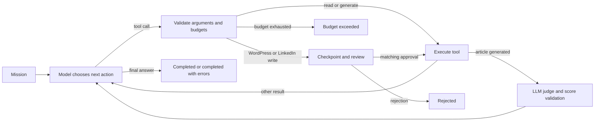

# ATLAS — Agentic SEO, Content and Social Publishing

ATLAS turns a natural-language mission into a stateful workflow: audit a website, research keywords, write and evaluate an article, then prepare reviewed WordPress or LinkedIn posts. **LangChain** provides model and tool interfaces; **LangGraph** manages execution, checkpoints, LLM judging and human review.

Built by Mohamed Yassine Aouidet.

## What it does

- **SEO auditing:** on-page HTML extraction, Lighthouse lab metrics, robots.txt and bounded sitemap discovery, followed by validated issue prioritization.
- **Keyword research:** autocomplete suggestions, intent classification, and semantic clusters. Rankings are model heuristics, not measured search volumes.
- **Article generation:** validated outline, HTML draft, sanitation, eight deterministic editorial checks, and one bounded revision attempt.
- **LLM-as-judge evaluation:** a separate Groq evaluator scores each generated article across five rubric dimensions, with validated reasons, a code-computed score out of 100 and an article-specific publication gate.
- **LinkedIn drafting:** turn supplied facts or a generated article into a concise text post. Drafts stay local until approved.
- **Reviewed publishing:** inspect the exact destination, content and visibility before any WordPress or LinkedIn write. Tokens and passwords stay out of the review payload.
- **Persistent execution:** reopen a paused mission using its ID, review it, and resume from the saved checkpoint.
- **Observable execution:** model calls, reported tokens, retries, tool latency, cache hits, errors and terminal status are returned with each mission.

## Measured results

These are **local offline reliability measurements**, using scripted model responses and fixture services. They do not establish live LLM accuracy, article quality, SEO gains or production latency.

| Measurement | Result | Evidence |
|---|---:|---|
| Automated tests | 117 passed | [Repository validation](evaluation/results/VALIDATION.md) |
| Statement + branch coverage | 82.37% | [Per-module coverage](evaluation/results/validation.json) |
| Workflow benchmark | 170/170 runs; 34 distinct scenarios × 5 repeats | [Results and methodology](evaluation/results/RESULTS.md) |
| Selected before/after regression probes | 1/7 → 7/7 | [Original-commit comparison](evaluation/results/BASELINE.md) |
| Repeated identical audit requests | 2 → 1 tool execution | [Caching probe](evaluation/results/baseline.json) |
| Judge harness checks | 10/10 synthetic protocol checks | [Judge protocol evaluation](evaluation/results/JUDGE_PROTOCOL.md) |
| Live article judge scores | Not yet measured | [Live evaluation status](evaluation/results/JUDGE_LIVE.md) |

The benchmark includes audit/research/writing, LinkedIn drafting and reviewed publishing, judge rejection/failure, invalid inputs, duplicate reads, budgets and recovery. The test suite also verifies checkpoint reopening, uncertain writes, HTTP controls, HTML sanitation, the LinkedIn API contract and Streamlit review rendering. Scripted judge responses are never presented as live article-quality measurements.

## Quick start

Python **3.11+** is required. Python **3.12** is the recorded local validation environment. Start with the offline evaluation; it needs no model key, WordPress account, Chrome or paid service.

```bash
git clone https://github.com/Tediuos/ATLAS.git
cd ATLAS
python -m venv .venv
# Linux / macOS
source .venv/bin/activate
# Windows PowerShell: .\.venv\Scripts\Activate.ps1
python -m pip install -r requirements-dev.txt
python -m atlas.evaluation.runner --repetitions 5
python -m pytest
```

`requirements-lock.txt` records the complete validated Python 3.12 environment. Install it instead of `requirements-dev.txt` to reproduce those package versions. Normal dependency ranges and CI also cover Python 3.11.

### Configure live tools

Copy `.env.example` to `.env` (`Copy-Item .env.example .env` in PowerShell) and choose a provider:

```dotenv
LLM_PROVIDER=groq
GROQ_API_KEY=your-key
GROQ_MODEL=llama-3.3-70b-versatile
```

Or use an Ollama model that supports tool calling and structured output:

```dotenv
LLM_PROVIDER=ollama
OLLAMA_MODEL=qwen2.5:7b
OLLAMA_BASE_URL=http://localhost:11434/v1
JUDGE_PROVIDER=ollama
JUDGE_MODEL=qwen2.5:7b
```

Model availability, hosting costs and provider rate limits depend on your setup. Groq is a hosted service; Ollama requires local model resources. The offline benchmark does not verify either provider's current model behavior.

For Lighthouse, install Node.js, Chrome and the CLI:

```bash
npm install -g lighthouse
```

Without Lighthouse, the audit can still use HTML data and reports the missing performance measurement. Its overall score is an ATLAS heuristic, not a Google ranking prediction. Lighthouse reports lab metrics such as LCP, CLS and TBT; it does not measure field INP here.

### Run a mission

```bash
python -m atlas.agent "Audit https://example.com and explain the highest-priority SEO issues."
streamlit run ui/streamlit_app.py --server.address localhost
```

The UI shows mission status, artifacts, execution metrics, and WordPress review controls. Use **Reopen a saved mission** after restarting the app.

### Review a WordPress write

Set `WP_URL`, `WP_USER`, and `WP_APP_PASSWORD` in `.env`. Use a WordPress Application Password and HTTPS for remote sites.

```bash
python -m atlas.agent "Research wordpress seo, write an article, and send it to WordPress as a draft."
python -m atlas.agent --inspect 1
python -m atlas.agent --resume 1 --approve-hash HASH_FROM_REVIEW
# To decline instead:
python -m atlas.agent --resume 1 --reject-hash HASH_FROM_REVIEW
```

Replace `1` with the returned mission ID. Inspect the full payload before copying its hash. Approval is tied to that exact payload. An ambiguous write failure stops execution and requires checking WordPress before another attempt; POST requests are never automatically retried. A durable journal reuses an existing receipt for an identical approved payload within the same mission.

The generated description is stored as the native WordPress excerpt. Mapping it to a Yoast/RankMath SEO field requires a site-specific integration. FAQ JSON-LD is retained as an export artifact; publishing sends the sanitized article HTML. No category/tag creation or scheduled-post support is claimed.

### Draft and post to LinkedIn

Configure an access token, the authenticated member/organization URN and a supported API version in `.env`:

```dotenv
LINKEDIN_ACCESS_TOKEN=your-token
LINKEDIN_AUTHOR_URN=urn:li:person:your-member-id
LINKEDIN_API_VERSION=202606
```

```bash
python -m atlas.agent "Draft a LinkedIn post about the benefits of typed agent state and publish it after review."
```

The agent drafts the text, then pauses to show the author, full commentary and public visibility. Approve through Streamlit or the same CLI inspect/resume commands. LinkedIn posts become public after approval; there is no remote draft mode. API access requires the appropriate LinkedIn product and permissions. This implementation uses the versioned [LinkedIn Posts API](https://learn.microsoft.com/en-us/linkedin/marketing/community-management/shares/posts-api?view=li-lms-2026-06), with `w_member_social` for member publishing or approved organization access.

LinkedIn writes use one POST attempt and the same durable receipt journal as WordPress. Failed or ambiguous responses require reconciliation. This version publishes text posts only; image uploads, scheduling, token refresh and OAuth onboarding are outside its scope.

### Evaluate articles with an LLM judge

Every generated article goes through the `judge` node before the agent's next planning step. Configure the evaluator independently:

```dotenv
JUDGE_PROVIDER=groq
JUDGE_MODEL=llama-3.3-70b-versatile
```

The rubric covers **relevance, clarity, structure, SEO and factual support**, each scored 1–5 with a rationale. Code computes `sum(scores) / 25 × 100`. Publication requires a current assessment of that exact article, a score of at least 70, no dimension below 3, and an `accept` recommendation. Missing or invalid assessments block publication. Without supporting evidence, factual support is capped at 3 and the review explicitly flags fact checking.

```bash
# Offline validation of score parsing, aggregation and gates
python -m atlas.evaluation.judge_run
# Real article generation and Groq judging; consumes provider quota
python -m atlas.evaluation.judge_run --live --samples 3 --repetitions 2
```

The live command saves articles, per-dimension scores, rationales, failure counts, token usage and repeat-score variation in `evaluation/results/judge_live.json`. These are model opinions, not validated factual truth or SEO impact. See [the judge rubric and limitations](docs/llm-judge.md).

## How the workflow works



`MissionState` retains messages, artifacts, pending actions, approval, cache, budgets, metrics and errors. Message and event reducers preserve the execution history. Pydantic validates tool inputs and structured model outputs. LangGraph controls state transitions and stores SQLite checkpoints.

Defaults: 12 planning iterations, 20 tool calls, 40 total model attempts, 60,000 reported tokens, 32,000 input characters per model request, and two retries for transient failures. Model calls made inside tools share the same usage budget. Token enforcement occurs before the next call and can overshoot by one response; missing provider token counts are recorded explicitly. See [architecture and trade-offs](docs/architecture.md).

## Evaluation and development

```bash
ruff check atlas ui tests
ruff format --check atlas ui tests
pytest --cov=atlas --cov-report=json:coverage.json --junitxml=test-results.xml
python -m atlas.evaluation.runner --repetitions 5
python -m atlas.evaluation.baseline
python -m atlas.evaluation.judge_run
python scripts/summarize_validation.py
```

The baseline command loads the original agent from commit `a4389d84` in local Git history. It requires a Git checkout containing that commit. All tests isolate databases and prohibit external socket connections. CI runs checks on Python 3.11 and 3.12 and uploads evaluation artifacts. Re-running measurements updates the reports; retain their environment and methodology when citing numbers.

See [evaluation methodology and CV wording](docs/evaluation.md) for denominators, limitations, and the live evaluation still needed.

## Project layout

```text
atlas/
  agent.py          CLI, mission history, inspect and resume
  workflow.py       LangGraph state, routing and tool execution
  schemas.py        Pydantic input/output/review contracts
  harness.py        Model budgets, retries, usage and diagnostics
  journal.py        Durable WordPress write receipts
  judge.py          Versioned LLM-as-judge rubric and derived quality gate
  llm.py            LangChain provider adapters and structured output
  network.py        URL checks, redirects and response limits
  content.py        HTML sanitation and editorial checks
  tools/            Audit, crawl, keywords, article, sitemap, WordPress, LinkedIn
  evaluation/       Scripted fixtures, scenarios and historical comparison
  db.py             SQLAlchemy artifact history
  seo_report.py     Escaped HTML reports; optional PDF export
ui/                 Streamlit interface
tests/              Offline unit, integration and UI smoke tests
evaluation/results/ Raw measurements and reports
docs/               Architecture and evaluation methodology
```

`data/` contains private local databases and is ignored by Git. Existing root-level `atlas.db` databases can be selected with `ATLAS_DB_PATH=atlas.db`; new installations use `data/atlas.db`. The introductory `hello_agent.py` and `hello_groq.py` remain provider smoke examples outside the production workflow.

## Scope and limitations

ATLAS is a single-user local application. Do not expose the Streamlit interface as a public multi-user service: it has no application authentication, and provider credentials are process-wide. Checkpoints contain mission text and content and should be treated as private data.

HTTP collection rejects private/reserved destinations by default, validates redirects and caps responses. `ATLAS_ALLOW_PRIVATE_URLS=true` explicitly enables local development sites. These application checks do not provide network isolation or eliminate DNS rebinding; Lighthouse can also load page subresources. Use trusted sites or an isolated environment for browser audits.

Prompt instructions, output schemas and HTML checks do not prove factual correctness or eliminate prompt injection. Human editorial review remains necessary. Exact-once remote publication is not guaranteed without server-side idempotency; the local journal deliberately stops on uncertain outcomes. Run one worker per mission and reconcile uncertain writes manually.

Optional PDF export requires WeasyPrint and system libraries and was not exercised by the offline validation. No live model quality, real WordPress integration, field performance or SEO uplift was measured in the recorded results.
